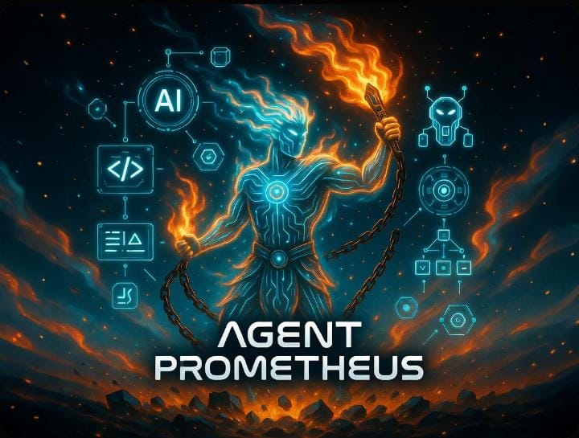

# Agent Prometheus 🔱

**The Titan-Class AI Orchestrator & Self-Improving Hive Mind.**

Agent Prometheus is a high-performance Meta-Framework that unifies the world's most specialized AI agents—**AutoGPT, OpenHands, crewAI, and gpt-engineer**—into a single, uncrashable entity.

> [!IMPORTANT]
> **Marketing Note:** If OpenClaw is a high-speed motorcycle, **Agent Prometheus is a diesel-powered freight train.** It is exponentially heavier, more secure, and built for heavy-duty engineering rather than personal assistance.

---

## 🔱 The Prometheus Core
Prometheus is not just a chatbot; it is an autonomous thinking engine designed to **Build, Research, and Innovate**.

### 🧠 Self-Improving Hive Mind
Using a persistent **ChromaDB Vector Brain**, Prometheus learns from every mistake. If it finds a fix for a technical hurdle on Monday, it applies that knowledge automatically to your next project on Friday.

### 📱 Remote Command (Telegram)
Command your local workforce from your phone. Receive **Interactive Approval Gates**, approve **SPEC.md** documents with a tap, and get final deliverables (Scripts, Data, Reports) sent directly to your chat.

### 🛡 The Uncrashable Keychain 
Powered by a **Tiered Mult-API Switchboard**, Prometheus dynamically routes tasks to the best model (Claude for Code, Gemini for Data, GPT-4o for Management). If one provider goes down, the system **hot-swaps** to a fallback instantly.

---

## 🏗 System Abilities
- **End-to-End Prototyping:** From a single prompt to a functional, debugged repo.
- **Autonomous Intelligence Gathering:** Web research, documentation scraping, and CSV delivery.
- **Spec-Driven Development:** Enforces a rigid **SSoT (Single Source of Truth)** via a Spec Guardian QA agent.
- **Zero-Token Selective Memory:** Decouples memory from context windows for near-infinite project recall.

---

### 🛠 Launch Sequence
1. **Forge the Titan:** `chmod +x setup.sh && ./setup.sh`
2. **Ignite the Pulse:** `docker-compose up -d`
3. **Open the Gates:** `python telegram_gateway.py`
4. **Awaken the Brain:** `python prometheus_manager.py` (Run in a separate shell)

*Once running, go to Telegram and send `/start`.*

---

## 📖 Project Documentation
- [Usage Guide](USAGE_GUIDE.md) - **Recommended for beginners. How to command the bot.**
- [Remote Control](REMOTE_CONTROL.md) - **Eyes and Hands. How to pair your local laptop.**
- [Installation Guide](INSTALL.md) - **Step-by-step setup for Linux, Mac, and WSL2.**
- [System Architecture](SYSTEM_ARCHITECTURE.md) - **Triage, Hot-Swaps, and M2M Protocols.**
- [Agent Abilities](AGENT_ABILITIES.md) - **Master Capabilities & OpenClaw Comparison.**
- [Hardware Specs](HARDWARE_SPECS.md) - **VPS Requirements & Device Compatibility.**
- [Honest Abilities](HONEST_ABILITIES.md) - **Wait, what *can't* it do? (Reality check).**
- [API Orchestration](API_ORCHESTRATION.md) - **Configuring the LiteLLM Key Chain.**
- [Development Log](PROMETHEUS_LOG.md) - **Chronicle of the Titan's Forge.**

---

---
**Forged for those who don't just want an assistant, but a machine that builds.**
