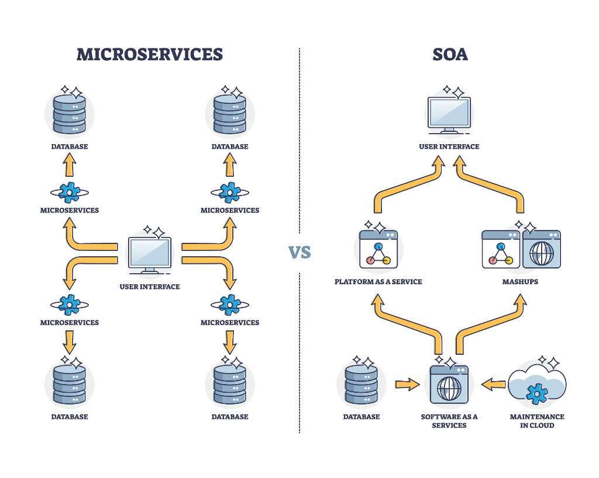

## 📱 V5 Evolution: Remote Command (Telegram)

Agent Prometheus is now a **Remote Workforce**. You can command the Hive Mind and approve specifications directly from your phone via the **Telegram Gateway**.

### 1. The "Front Desk" Protocol
You no longer need to watch the terminal. Send a task on Telegram, and the Gateway handles the asynchronous execution. The agents will text you when they reach a milestone or need a decision.

### 2. Interactive Approval Gates
Prometheus uses **Inline Telegram Buttons** for security and token efficiency. 
- After drafting a `SPEC.md`, the AI pauses.
- You receive an **Approve ✅** or **Reject ❌** button.
- The forge only begins when you give the green light.

### 3. Absolute Security
The system is hard-locked to your personal Telegram `chat_id`. It will ignore all other users, ensuring your local machine remains a private fortress.

---

Agent Prometheus has evolved from basic integration to a **Microservices-Based Agent Architecture**. This preserves the "magic" of framework-specific reasoning loops while enforcing a **Single Source of Truth (SSoT)**.

### 1. Spec-Driven Development
Prometheus no longer codes from generic prompts. The process is now strictly controlled:
- **Phase 1: Spec Generation:** The Architect generates a strict `SPEC.md`.
- **Phase 2: TDD Preparation:** The Architect generates failing tests *before* coding begins.
- **Phase 3: Service Execution:** specialized frameworks (OpenHands, AutoGPT) are treated as **APIs**, preserving their internal brilliance.
- **Phase 4: The Spec Guardian:** A QA agent audits all work against the `SPEC.md`. If a feature is "Out-of-Scope," it is rejected.

### 2. Architecture Comparison

Prometheus utilizes a Microservices-style approach (left) to ensure failure in one agent doesn't bring down the Titan.

---

## 🏗 System Architecture & Specs

### Agent Ability Matrix
| Agent | Role | LLM Tier | Primary Framework |
| :--- | :--- | :--- | :--- |
| **Architect (Titan)** | Structural Design | Economy | gpt-engineer |
| **Specialist (Hephaestus)** | Execution | Precision | OpenHands |
| **Scout (Hermes)** | Intelligence | Economy | AutoGPT |
| **Refiner** | Optimization | Economy | Integration Logic |
| **Orchestrator** | Management | High-Reasoning | crewAI (Manager) |

---

## 🚀 Setup Instructions

### 1. Environment Configuration
Create a `.env` file in the root directory:
```bash
# Providers (Only fill what you use)
REAL_API_KEY=your_openai_key
ANTHROPIC_API_KEY=your_anthropic_key
GEMINI_API_KEY=your_gemini_key
```

### 2. Launch Infrastructure
```bash
docker-compose up -d
```
*Note: V2 enables **Prompt Caching** by default via LiteLLM to reduce costs for repetitive system prompts.*

### 3. The "Switchboard" Hijack
Prometheus "hijacks" the connection of sub-frameworks to ensure they use the correct cost-optimized model:
```bash
# Force specialized agents to talk to the local switchboard
OPENHANDS_OPENAI_API_BASE=http://localhost:4000
OPENHANDS_OPENAI_MODEL_NAME=coding-model

AUTOGPT_OPENAI_API_BASE=http://localhost:4000
AUTOGPT_OPENAI_MODEL_NAME=research-model
```

---

## 📖 Operational Documentation
- [System Architecture](SYSTEM_ARCHITECTURE.md) - Deep dive into the V2 execution lifecycle.
- [Agent Abilities](AGENT_ABILITIES.md) - Updated for the new "Refiner" and "Summarizer" roles.
- [API Orchestration](API_ORCHESTRATION.md) - Guide to the Tiered Routing and LiteLLM Proxy.
- [Development Log](PROMETHEUS_LOG.md) - The chronicle of the V2 refactor.

## 🧹 Maintenance
To reset the global state and workspace:
```bash
rm -rf shared_workspace/*
```

---

## 🛡 License
This project is open-source. Forged for builders who want the power of all agents with the cost of only one.
