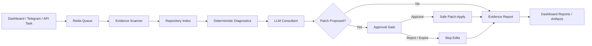

<div align="center">

<svg width="100%" height="220" viewBox="0 0 1200 220" xmlns="http://www.w3.org/2000/svg" role="img" aria-label="Workspace Runtime banner">
  <defs>
    <linearGradient id="g" x1="0" y1="0" x2="1" y2="1">
      <stop offset="0%" stop-color="#111827"/>
      <stop offset="55%" stop-color="#1f2937"/>
      <stop offset="100%" stop-color="#0f172a"/>
    </linearGradient>
    <filter id="shadow" x="-20%" y="-20%" width="140%" height="140%">
      <feDropShadow dx="0" dy="18" stdDeviation="22" flood-color="#000" flood-opacity="0.28"/>
    </filter>
    <style>
      .pulse { animation: pulse 2.6s ease-in-out infinite; transform-origin: center; }
      .dash { stroke-dasharray: 8 12; animation: flow 12s linear infinite; }
      @keyframes pulse { 0%,100% { opacity: .55; transform: scale(.98); } 50% { opacity: 1; transform: scale(1.02); } }
      @keyframes flow { from { stroke-dashoffset: 180; } to { stroke-dashoffset: 0; } }
    </style>
  </defs>
  <rect width="1200" height="220" rx="28" fill="url(#g)"/>
  <g filter="url(#shadow)">
    <rect x="70" y="48" width="1060" height="124" rx="24" fill="#ffffff" opacity="0.06" stroke="#ffffff" stroke-opacity="0.18"/>
    <circle class="pulse" cx="148" cy="110" r="34" fill="#22c55e" opacity="0.9"/>
    <circle cx="148" cy="110" r="16" fill="#ecfeff"/>
    <path class="dash" d="M210 110 H1000" stroke="#93c5fd" stroke-width="3" fill="none" opacity="0.78"/>
    <text x="230" y="93" fill="#f8fafc" font-family="Inter,Segoe UI,Arial" font-size="36" font-weight="800">Workspace Runtime</text>
    <text x="230" y="132" fill="#cbd5e1" font-family="Inter,Segoe UI,Arial" font-size="20">Evidence first. Model second. Human approval before edits.</text>
    <rect x="875" y="74" width="170" height="44" rx="22" fill="#22c55e" opacity="0.16" stroke="#86efac"/>
    <text x="914" y="102" fill="#bbf7d0" font-family="Inter,Segoe UI,Arial" font-size="16" font-weight="700">LEAN MODE</text>
    <rect x="875" y="124" width="170" height="32" rx="16" fill="#38bdf8" opacity="0.12" stroke="#7dd3fc"/>
    <text x="918" y="146" fill="#bae6fd" font-family="Inter,Segoe UI,Arial" font-size="13" font-weight="700">APPROVAL GATED</text>
  </g>
</svg>

# Workspace Runtime

### A controlled AI workbench for reading code, finding gaps, proposing fixes, and producing evidence reports.

[](#runtime-principle)
[](#run-lean-mode)
[](#safety-model)
[](#llm-options)

</div>

---

## What this is

Workspace Runtime is an AI-assisted developer operations system built around one rule:

```text
The system executes. The AI consults.
```

It accepts a task, scans the mounted workspace, indexes real files, runs deterministic checks, sends bounded evidence to an LLM, receives structured JSON findings, creates patch proposals, waits for approval, then writes reports and artifacts.

It is not meant to be a blind “agent swarm.” It is a controlled runtime with evidence, logs, approval gates, and inspectable outputs.

---

## Runtime principle

<div align="center">



</div>

The model does not get to pretend it ran tests. It gets evidence and returns a structured plan. The runtime decides what is safe to apply.

---

## Why lean mode exists

The earlier full stack was too heavy for normal testing because it ran the router, memory DB, dashboard dev server, Telegram, and vision services together.

Lean mode keeps the same main output path:

```text
Task → evidence scan → model call → approval → report/artifacts
```

But makes the heavy pieces optional.

| Mode | RAM target | What runs | Best for |
|---|---:|---|---|
| Lean | 2–4 GB | Redis, backend, consultant, production dashboard | Normal testing, small VPS, laptop |
| Lean + Telegram | 3–5 GB | Lean + Telegram gateway | Mobile task intake and approvals |
| Lean + Router | 4–6 GB | Lean + LiteLLM router | Multi-provider model routing |
| Core | 8 GB recommended | Router, ChromaDB, Telegram, vision bridge, dev dashboard | Full internal stack testing |
| Full / OpenHands | 16 GB+ | Optional sandbox service too | Heavy developer automation experiments |

---

## Run lean mode

Copy env and add your model key:

```bash
cp .env.example .env
```

Edit `.env`:

```env
OPENAI_API_BASE=https://api.openai.com/v1
OPENAI_API_KEY=your_key_here
PROMETHEUS_CONSULTANT_MODEL=gpt-4o-mini
PROMETHEUS_CHEAP_MODEL=gpt-4o-mini
```

Start the lean runtime:

```bash
docker compose -f docker-compose.lean.yml up --build
```

Open:

```text
Dashboard: http://localhost:5173
Backend:   http://localhost:8000/health
```

Optional profiles:

```bash
# Add Telegram gateway
docker compose -f docker-compose.lean.yml --profile telegram up --build

# Add LiteLLM router
docker compose -f docker-compose.lean.yml --profile router up --build

# Add Chroma memory
docker compose -f docker-compose.lean.yml --profile memory up --build

# Add vision bridge
docker compose -f docker-compose.lean.yml --profile vision up --build
```

---

## What people can use this agent for

### Codebase auditing
Find disconnected routes, dead endpoints, broken imports, unused files, missing env variables, and weak startup paths.

### Repo cleanup
Merge scattered documentation, remove old product names, identify legacy folders, and create a cleaner unified system map.

### API and route verification
Map backend routes, dashboard calls, queues, websocket surfaces, artifacts, and approval endpoints.

### PR review assistant
Scan a branch, summarize risks, propose tests, and produce a review report before merging.

### Documentation generation
Turn scattered README files and code comments into one polished product README, architecture guide, or deployment checklist.

### Safe patch proposals
Ask it to propose tiny file edits while keeping human approval required before the runtime applies changes.

### Deployment readiness checks
Check Docker Compose, health routes, environment variables, ports, startup order, and service boundaries.

### Evidence reports for clients or teams
Produce JSON/Markdown reports that show what was scanned, what was found, what is missing, and what should be done next.

### Personal coding command center
Use the dashboard as a cockpit for repo tasks, logs, reports, artifacts, approvals, and runtime status.

### Lightweight AI operations backend
Use it as a base for controlled AI workflows where you need queues, approval, logs, artifacts, and model routing.

---

## Connected surfaces

| Surface | Purpose |
|---|---|
| Dashboard | Task intake, live logs, queue view, reports, artifacts, approvals, kill switch |
| Backend API | Runtime status, tasks, approvals, reports, artifacts, logs, websocket stream |
| Redis | Queue, logs, notifications, approval state, kill-switch state |
| Consultant runtime | Evidence scan, index, model call, patch proposal, report writing |
| Telegram profile | Optional mobile task intake and approval buttons |
| LiteLLM profile | Optional multi-provider model router |
| Chroma profile | Optional persistent memory store |
| Vision profile | Optional paired observation bridge |

---

## Runtime API

```text
GET    /health
GET    /stats
GET    /logs
GET    /queue
GET    /notifications
GET    /runtime/config
GET    /runtime/routes
GET    /approvals
POST   /approvals/{approval_id}/approve
POST   /approvals/{approval_id}/reject
WS     /ws/logs
POST   /tasks
POST   /control/kill-switch
DELETE /control/kill-switch
GET    /artifacts
GET    /artifacts/{artifact_path:path}
GET    /reports
GET    /vision_node.py
```

---

## LLM options

Lean mode talks directly to any OpenAI-compatible endpoint:

```env
OPENAI_API_BASE=https://api.openai.com/v1
OPENAI_API_KEY=your_key
PROMETHEUS_CONSULTANT_MODEL=gpt-4o-mini
```

You can also point it to Groq, OpenRouter, local LiteLLM, or another OpenAI-compatible proxy by changing `OPENAI_API_BASE` and the model name.

For stronger reasoning, use a better consultant model:

```env
PROMETHEUS_CONSULTANT_MODEL=gpt-4o
```

For cheapest smoke tests, keep:

```env
PROMETHEUS_CONSULTANT_MODEL=gpt-4o-mini
```

For multi-provider routing, enable the router profile and use aliases from `config/litellm_config.yaml`:

```bash
docker compose -f docker-compose.lean.yml --profile router up --build
```

Then set:

```env
OPENAI_API_BASE=http://litellm:4000/v1
OPENAI_API_KEY=sk-prometheus-dummy
PROMETHEUS_CONSULTANT_MODEL=consultant-model
```

---

## Main runtime files

| File | Role |
|---|---|
| `prometheus_consultant.py` | Main evidence-driven consultant loop |
| `prometheus_indexer.py` | Repository structure and route/index scanner |
| `prometheus_json.py` | JSON repair and normalization for model responses |
| `backend/src/main.py` | FastAPI runtime API |
| `dashboard/src/App.tsx` | React command center |
| `telegram_gateway.py` | Optional Telegram frontdesk |
| `vps_receiver.py` | Optional vision bridge receiver |
| `docker-compose.lean.yml` | Lightweight default runtime |
| `docker-compose.core.yml` | Larger core stack with router/memory/vision |

---

## Safety model

Workspace Runtime is safe by default:

- auto-apply is disabled
- approval is required before patch application
- evidence packets are bounded
- `.env`, generated folders, dependency folders, archives, databases, and binary-heavy files are ignored
- Python syntax checks use `compile()` and do not write `.pyc` files
- protected paths such as `.git`, `node_modules`, `venv`, `__pycache__`, and `hive_mind_db` cannot be edited
- path traversal is blocked
- reports are written for inspection
- missing evidence is reported instead of guessed

Enable automatic patching only in a trusted local workspace with backups:

```bash
PROMETHEUS_AUTO_APPLY=true
PROMETHEUS_REQUIRE_APPROVAL=false
```

---

## Verification

Static checks:

```bash
python -m py_compile prometheus_consultant.py prometheus_indexer.py prometheus_json.py backend/src/main.py telegram_gateway.py vps_receiver.py
python -m pytest -q tests/test_consultant_runtime.py
docker compose -f docker-compose.lean.yml config
```

Core smoke test:

```bash
chmod +x tools/docker_smoke_check.sh
COMPOSE_FILE=docker-compose.lean.yml ./tools/docker_smoke_check.sh
```

Manual API test:

```bash
curl http://localhost:8000/health
curl http://localhost:8000/runtime/routes
curl -X POST http://localhost:8000/tasks \
  -H 'Content-Type: application/json' \
  -d '{"task":"Review this workspace and report disconnected routes."}'
```

---

## Naming policy

The runtime name is configurable through:

```env
APP_NAME=Workspace Runtime
```

Change that value to rename the system without editing code.

Avoid exposing upstream project names as product identity. References to AutoGPT, OpenHands, CrewAI, and GPT Engineer should remain implementation inspiration or optional integration context, not user-facing branding.

---

## Status

The connected path is now:

```text
Dashboard task → Redis queue → Consultant runtime → Evidence scan → LLM plan → Approval gate → Patch/result report → Dashboard artifacts
```

Lean mode makes that path cheaper to run while keeping the same final output: reports, approvals, logs, artifacts, and structured findings.
