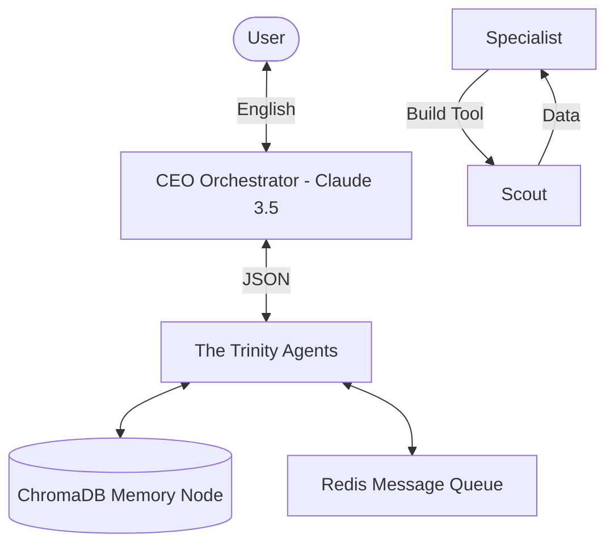

# System Architecture: Agent Prometheus (V4.1 - The Hive Mind)

V4.1 marks the transition to a **Self-Improving Hive Mind** powered by **ChromaDB**. It decouples memory from context windows and implements a persistent Vector-based "Shared Brain."

## 1. Decentralized Memory (Vector Memory Node)
Prometheus V4.1 utilizes a **Local Vector Database** (ChromaDB) to act as its "Shared Brain." This decouples memory from the LLM's context window, allowing for infinite, token-efficient recall.

- **Selective Recall:** Agents query the vector node with their current task. The database returns only the ~2 most relevant past lessons (JSON format), costing near-zero tokens.
- **Persistent Logic:** Experience is stored in `/shared_workspace/hive_mind_db`, surviving restarts and container wipes.
- **M2M Lessons:** Successes and failures are automatically converted into embeddings for future similarity searches.

## 2. Machine-to-Machine (M2M) Communication
To slash token costs, we have abolished English for internal communication. Agents now transmit data via **Strict JSON Schemas** over a Redis message queue.

- **Human-to-Machine:** English (User Interface).
- **Machine-to-Human:** English (Reporting).
- **Machine-to-Machine:** JSON/DSL (Internal Execution).

## 3. The Continuous Learning Loop (Reflection)
Prometheus now performs a **Post-Mortem** after every task failure or success.
- **Evaluation:** The CEO Agent analyzes why a task succeeded or failed.
- **Optimization:** Lessons learned (e.g., "yt-dlp breaks on Python 3.12") are recorded as embeddings in the Vector Node via `record_lesson`.
- **Pre-Flight Check:** Every new task begins with `get_advice` to fetch relevant past experiences.

## 4. Dynamic Tooling (Agents for Agents)
The specialist agents can now **request the creation of new tools**.
- **The Request:** Hermes (The Scout) pings Hephaestus (The Specialist): "I need a custom scraper tool."
- **The Creation:** Hephaestus writes, tests, and validates the Python script.
- **The Deployment:** The script is registered as a new "Local Tool" for the Hive Mind.

## 5. Hierarchical Governance (The CEO)
To prevent the Hive Mind from spiraling, all tool-creation and memory-update requests must be approved by the **CEO Agent** (Powered by Claude 3.5 Sonnet).

