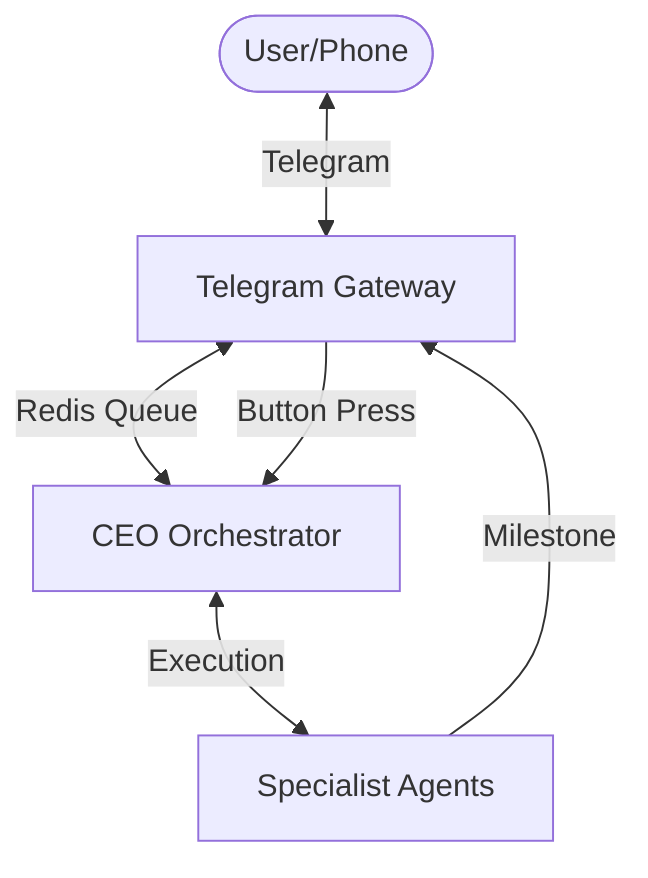

# System Architecture: Agent Prometheus (V5 - Remote Command)

V5 introduces the **Telegram Gateway (The Front Desk)**, transforming Prometheus into an asynchronous, remote-accessible workforce.

## 1. The "Front Desk" Architecture
Prometheus is no longer tethered to a local terminal. The Gateway acts as a secure buffer between the user and the Hive Mind.

- **Inbound:** Commands sent via Telegram are pushed to a `prometheus_tasks` Redis queue.
- **Outbound:** Agents push status updates and milestones to a `prometheus_notifications` queue for Telegram delivery.

## 2. Security Guardrails
- **Hardcoded Identity:** The system explicitly checks the `chat_id`. It will ignore anyone except the authorized creator.
- **Goal-Oriented Commands:** Only high-level natural language tasks are accepted. Direct "run code" commands from Telegram are prohibited for safety.

## 3. Human-in-the-Loop (HitL) Gates
The architecture now supports **Interactive Approvals**. 
- The system will pause execution after generating a `SPEC.md`.
- It sends an inline button interface to Telegram: **Approve ✅** or **Reject ❌**.
- The AI agents sleep (saving tokens) until the user provides the "Go" signal.

## 4. Token-Optimized Notifications
To prevent notification bloat, agents only use the `notify_boss` tool at specific milestones:
1. Task Initialization.
2. Major Spec/Architecture Approval (HitL).
3. Final Delivery.

