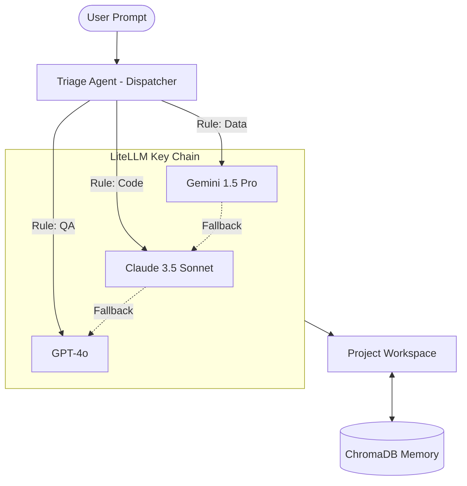

# System Architecture: Agent Prometheus (The Uncrashable Hive Mind)

## 1. Multi-API Provider & Fallback (The Keychain)
Agent Prometheus does not rely on a single brain. It uses a **provider-agnostic keychain** managed by the **LiteLLM Gateway**.

### The Hot-Swap Logic
If Anthropic (Claude) goes down or hits a rate limit, the LiteLLM Gateway intercepts the 500 error and **instantly hot-swaps** the request to a fallback provider (OpenAI). 
- **Universal Translation:** LiteLLM translates the payload between provider-specific JSON formats (e.g., converting Anthropic's system prompt format to OpenAI's) in milliseconds. 
- **Continuity:** The agents are unaware the brain changed; they simply receive the next line of logic.

## 2. Dynamic Triage (The Dispatcher)
Every task coming from the Telegram Gateway is processed by the **Triage Agent**.

- **Heuristic Routing:**
  - **Coding/Refactoring:** Routed to **Claude 3.5 Sonnet** (The best coding syntax).
  - **Heavy Research/Data:** Routed to **Gemini 1.5 Pro** (Massive 2M context window).
  - **Orchestration/SSoT:** Routed to **GPT-4o** (Highest obedience to JSON/Specs).

## 3. The Hive Mind Ledger (State vs. Logic)
By storing the **Experience Ledger** (ChromaDB) and the **Project Files** (Workspace) locally, we have decoupled the **State** from the **Logic Processor**. 
- You can swap, upgrade, or add new API keys at any time without resetting the agent's progress or history.

## 4. Communication Architecture
- **Internal:** M2M JSON Protocol over Redis.
- **External:** Telegram Gateway with interactive HitL approval gates.
- **Memory:** Vector Memory Node (Zero-Token Selective Recall).

