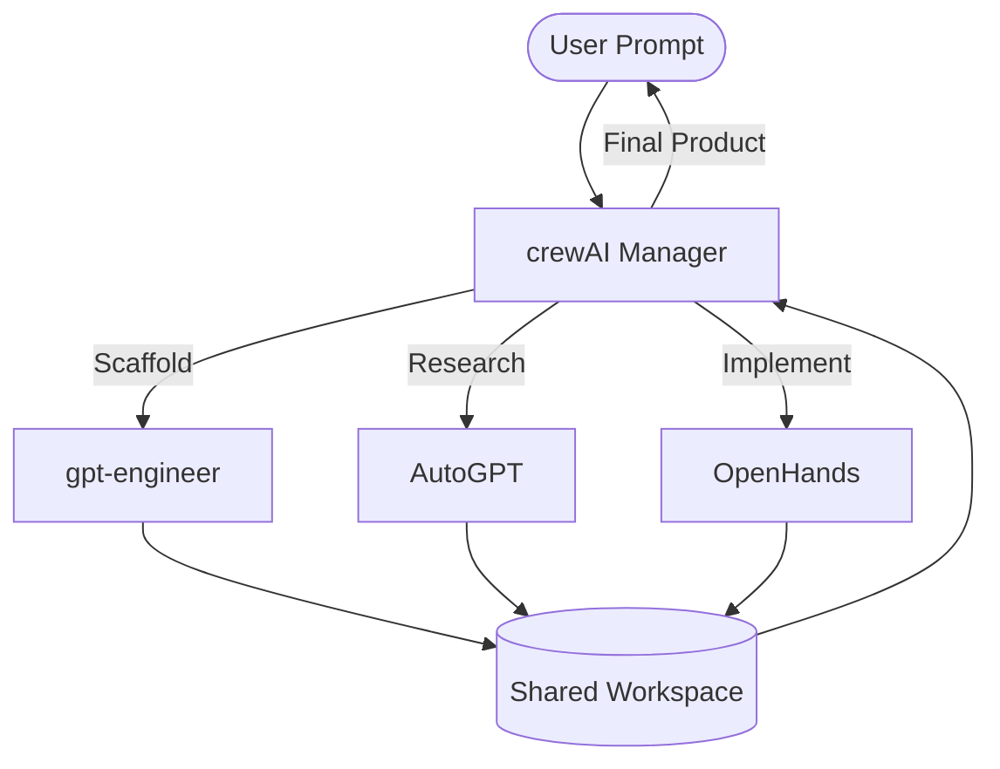

# System Architecture: Agent Prometheus

This document outlines the execution model for the hybrid integration of AutoGPT, OpenHands, crewAI, and gpt-engineer into a single, cohesive "Super-Agent" system.

## 1. Executive Summary
The "Agent Prometheus" system is a hierarchical Multi-Agent System (MAS). It leverages **crewAI** as the cognitive core (the "Brain"), which treats the other frameworks as specialized "Capability Modules" rather than standalone applications.

## 2. The Execution Lifecycle

### Phase I: Decomposition & Planning (crewAI + gpt-engineer)
1. **User Input:** The user provides a high-level goal (e.g., "Build a full-stack weather app with real-time alerts").
2. **Analysis:** The `Manager Agent` (crewAI) uses a specialized `Architect Tool`.
3. **Scaffolding:** The Architect Tool triggers **gpt-engineer**. gpt-engineer performs its clarification ritual, asks the user 3-5 critical questions, and then generates the base repository structure (frontend/backend/DB).

### Phase II: Deep Research (AutoGPT)
1. **Information Scarcity:** If the implementation requires specific external data (e.g., "Best free weather API for 2024"), the crewAI manager spawns an **AutoGPT** instance.
2. **Autonomous Browsing:** AutoGPT operates in a dedicated sandbox, scouring the web, comparing docs, and saving a `research_summary.md` to the shared workspace.
3. **Internalization:** The crewAI manager reads the summary and updates the task list for the developers.

### Phase III: Sandbox Implementation (OpenHands)
1. **Coding:** The `Lead Developer Agent` (crewAI) delegates specific coding tasks to **OpenHands**.
2. **Execution loop:** OpenHands operates within a Dockerized terminal. It writes the code, attempts to run it, catches its own errors, and fixes them using its native RL loop.
3. **Pull Request:** Once OpenHands confirms the code is "passing," it notifies the Master Crew.

### Phase IV: Integration & Quality Assurance (Master Crew)
1. **Review:** A crewAI `QA Agent` runs a final verification script across the generated codebase.
2. **Finalization:** The system presents the finished, tested product to the user.

## 3. Data Flow Diagram

## 4. Operational Guardrails
- **Shared Workspace:** All frameworks map to `/home/imran/Code/agent_frameworks/workspace`.
- **Context Persistence:** crewAI maintains a `global_state.json` to ensure that if AutoGPT fails, the Developer Agent knows which research was skipped.
