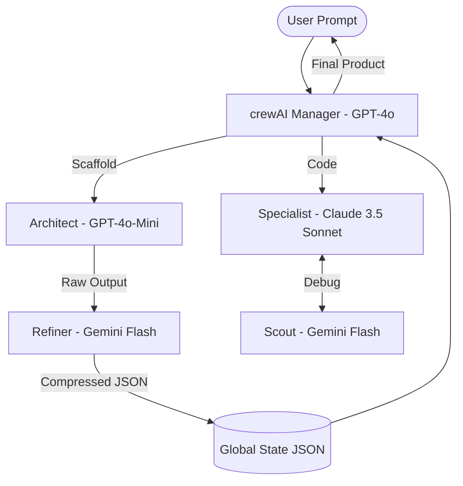

# System Architecture: Agent Prometheus (V2)

This document outlines the **Modular Tool Intelligence** model, which replaces the high-bloat "Framework Chaining" approach.

## 1. The Modular Philosophy
Rather than running four heavy, competing frameworks in full, Prometheus V2 treats them as **specialized toolsets** managed by a central **Hierarchical Orchestrator** (crewAI).

### The "Frankenstein" Fix:
- **Decomposition:** We don't call the "AutoGPT App"; we use its autonomous search logic inside a crewAI Agent.
- **Interoperability:** Communication is no longer just "files on a disk." We use **Strict JSON Handshakes** and a **Centralized Refiner** to ensure context is never lost or misunderstood.

## 2. The Tiered Execution Lifecycle

### Phase I: The Structural Blueprint (Economy Tier)
- **Goal:** Minimize cost for boilerplate. 
- **Action:** The Architect (gpt-engineer logic) uses **GPT-4o-Mini** to generate the folder structure.

### Phase II: The Refiner Cycle (Efficiency Tier)
- **Action:** Before any data moves from the Architect to the Specialist, the **Refiner** (Gemini Flash) summarizes the requirements. This keeps the prompt history clean and leverages **Prompt Caching**.

### Phase III: The Forge (Precision Tier)
- **Action:** The Specialist (OpenHands logic) implements the code using **Claude 3.5 Sonnet**. If errors occur, it retrieves research via the Scout.

### Phase IV: Hierarchy & QA (Reasoning Tier)
- **Action:** A dedicated **Manager Agent** (crewAI) reviews every step. It has a `max_iter=5` safety floor to prevent infinite loops.

## 3. Data Flow Diagram (V2)

## 4. Key Performance Indicators (KPIs)
- **Token Efficiency:** ~60% reduction compared to V1 via Refiner & Tiered Routing.
- **Stability:** 100% loop-prevention via strict `max_iter` enforcement.
- **Context Depth:** Persistent `global_state.json` ensures the Specialist knows the Architect's "why" as well as the "what."
