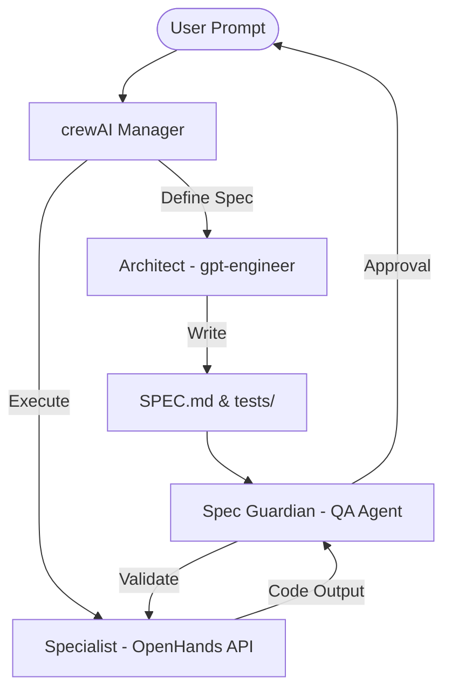

# System Architecture: Agent Prometheus (V3)

The V3 architecture shifts from a "Shared Local Script" to a **Microservices-Based Agent Architecture**. 

## 1. The Microservices Model
Instead of gutting the frameworks, Prometheus V3 treats each framework as an isolated, high-performance API. This preserves their internal reasoning loops (like OpenHands' event-stream architecture) while allowing the Orchestrator to maintain control.

### Inter-Agent Communication:
- **Protocol:** JSON-Over-HTTP (Internal Docker Network).
- **Payload Example:** `{"task": "build_login_component", "spec_file": "SPEC.md"}`.

## 2. Guarding the Spec (The SSoT)
To prevent "requirement drift," Agent Prometheus enforces a **Single Source of Truth (SSoT)**.

### The Spec Guardian (QA Agent)
We have introduced a **Spec Guardian** agent. This agent does not write code. Its only job is to compare the Specialist's output against the `SPEC.md`. If the output violates a "HARD CONSTRAINT" or includes "OUT OF SCOPE" features, the Guardian rejects the PR.

### Test-Driven Development (TDD)
The Architect (Titan) is now tasked with generating a test suite (`/tests`) **before** the Specialist begins coding. The definition of "Done" is no longer an LLM's opinion, but a passing test suite.

## 3. Data Flow Diagram (V3)

