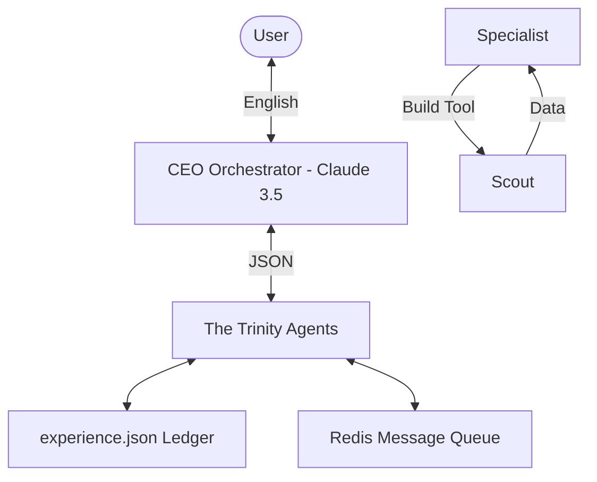

# System Architecture: Agent Prometheus (V4 - The Hive Mind)

V4 marks the transition from a "Team of Agents" to a **Self-Improving Hive Mind**. It decouples memory from context windows and implements a machine-to-machine communication layer.

## 1. Decentralized Memory (The Shared Brain)
Prometheus V4 no longer relies on agents "remembering" things in their prompt. We have decoupled memory into a **Centralized Memory Node**.

- **Short-Term Context:** Managed by Redis for high-speed agent-to-agent handshakes.
- **Long-Term Experience:** Stored in a Vector-simulated `experience.json` ledger.
- **System Core:** Non-negotiable rules (Owner's Rules) are injected into every agent's "System Core" upon initialization.

## 2. Machine-to-Machine (M2M) Communication
To slash token costs, we have abolished English for internal communication. agents now transmit data via **Strict JSON Schemas** over a Redis message queue.

- **Human-to-Machine:** English (User Interface).
- **Machine-to-Human:** English (Reporting).
- **Machine-to-Machine:** JSON/DSL (Internal Execution).

## 3. The Continuous Learning Loop (Reflection)
Prometheus now performs a **Post-Mortem** after every task failure or success.
- **Evaluation:** The QA Agent (The Judge) analyzes why a task succeeded or failed.
- **Optimization:** Lessons learned (e.g., "Library X is incompatible with Python 3.12") are written to the `experience.json` ledger.
- **Initialization:** Every new task begins by reading the "Lessons Learned" ledger to prevent repeating past mistakes.

## 4. Dynamic Tooling (Agents for Agents)
The specialist agents can now **request the creation of new tools**.
- **The Request:** Hermes (The Scout) pings Hephaestus (The Specialist): "I need a Selenium-based scraper for [URL]."
- **The Creation:** Hephaestus writes, tests, and validates the Python script.
- **The Deployment:** The script is registered as a new "Local Tool" for the Scout to use immediately.

## 5. Hierarchical Governance (The CEO)
To prevent the Hive Mind from spiraling (e.g., agents deleting their own code), all tool-creation and memory-update requests must be approved by the **CEO Agent** (Powered by Claude 3.5 Sonnet).

